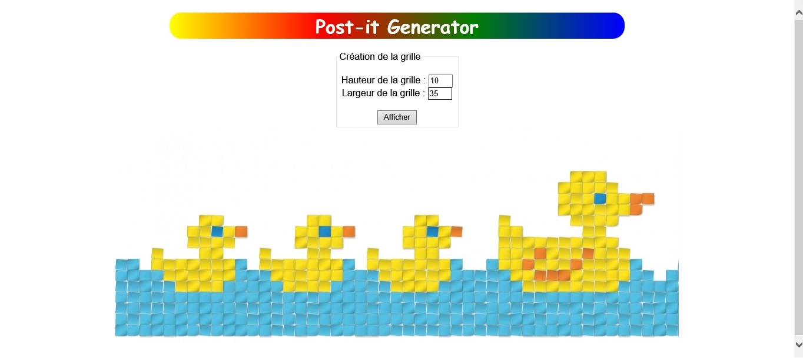

# Projet_Web-Post-it
## Projet Web 2016
Création d’une interface de Post-it War. L’application doit permettre de créer ses illustrations à base de post-it, et de connaitre le nombre de post-it nécessaires. Vous êtes totalement libre sur l’interface graphique.


Néanmoins, voici les contraintes que vous devrez intégrer :
* Au départ, demandez la taille de la grille et réalisez cette grille (ça peut être dans une liste de choix prédéfinis, ou bien deux nombres correspondants à la largeur et la hauteur)
* Proposez au minimum 4 couleurs de post-it :
  * Lorsque l’on choisit une couleur (au clic) faites en sorte que l’on voit visuellement celle qui est sélectionnée (surbrillance, bordure, etc.)
* Remplir les cases de la grille (avec la couleur de post-it sélectionnée) :
  * lors d’un clic sur une case
  * lors d’un clic puis d’un déplacement de la souris sur la grille : remplir en « tempsréel» toutes les cases qui sont survolées
  * si la case contient déjà un post-it, ne pas la remplir
* Affichez le total de post-it utilisés pour chaque couleur (à chaque fois qu’un nouveau post-it est ajouté)
* Ajoutez la fonction « effacer des post-it » (case à cocher, clic-droit, bouton, etc.) au choix : en mode simple (clic par clic) ou avancé (déplacement de la souris)
* Ajoutez la fonction « vider la grille » qui doit effacer tous les post-it
* A la fin, envoyez la commande (nombre de post-it de chaque couleur) à un serveur (page à créer par vos soins) vous renvoyant le montant total de votre commande. En fonction d’un prix que vous fixerez pour chaque post-it. (les échanges doivent se faire en JSON).

Par exemple, lors de l’envoi :
```json
{
  "post-its" : {
    "rouge" : 15,
    "bleu" : 12
  }
}
```
Puis lors du retour :
```json
{
  "prix" : 152,
}
```
* Le tout sur une page respectant les bonnes pratiques sémantiques (HTML, accessibilité, etc.)

### Rendu




```json
{
	"post-it" : {
		"black" : "0.03 * 89",
		"purple" : "0.0168 * 86"
	},
	"prix" : 4.1148
}
```